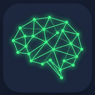
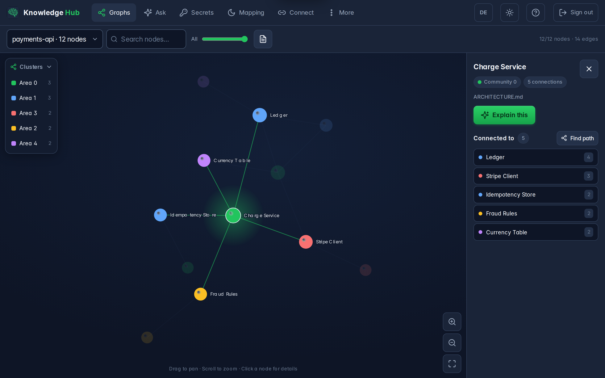
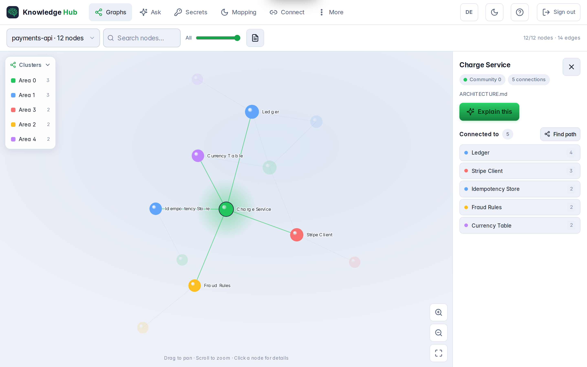
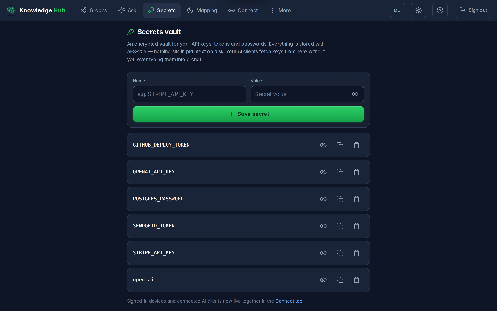
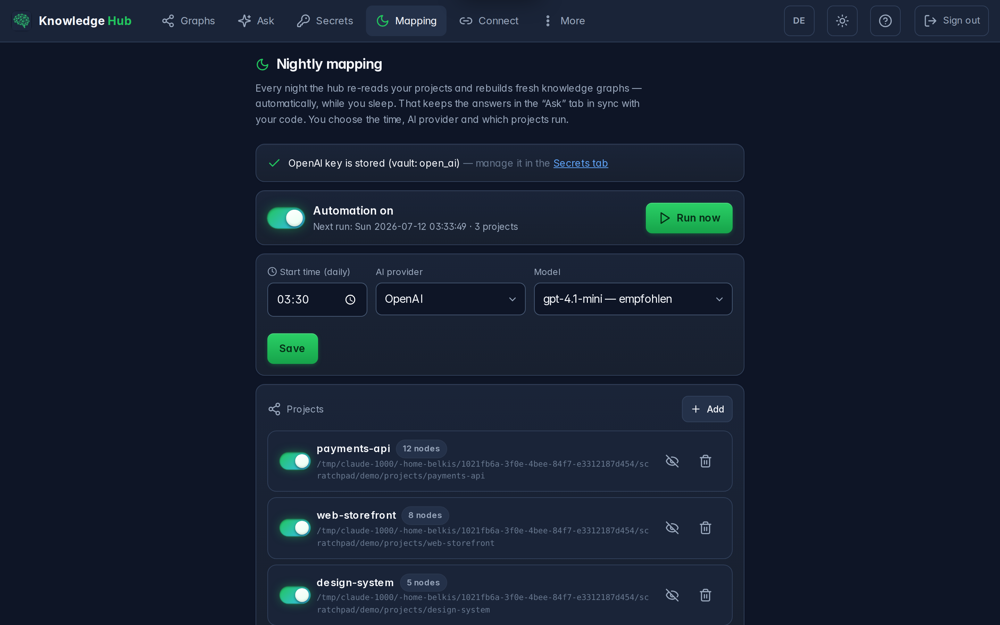
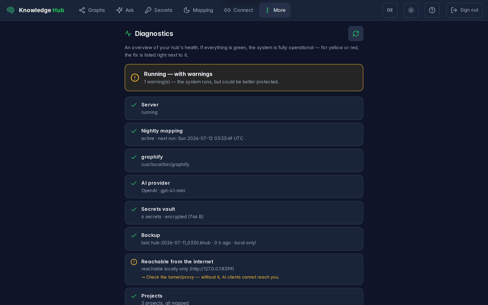
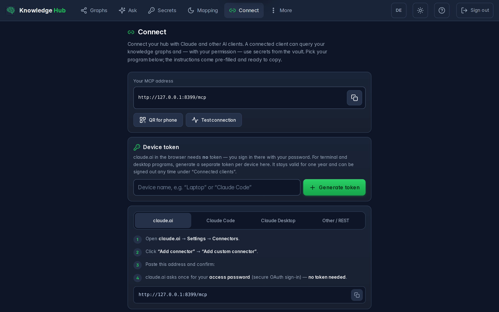
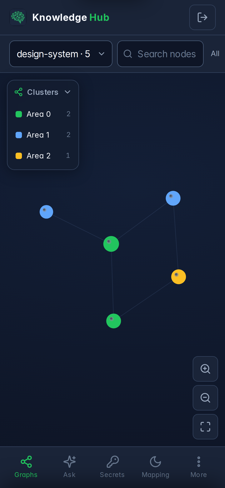

<div align="center">



# Knowledge Hub

**Your codebase as a knowledge graph. Your secrets in an encrypted vault.
Both reachable by your AI assistant — and by nobody else.**

A self-hosted [MCP](https://modelcontextprotocol.io) server with a web interface.
It maps your projects into queryable knowledge graphs every night, keeps your API keys
in an AES-256 vault, and hands both to Claude, ChatGPT, or any MCP-capable client —
without you ever pasting a credential into a chat window.

[](https://github.com/BEKO2210/Knowledge-Hub/actions/workflows/ci.yml)
[](LICENSE)
[](https://www.python.org/)
[](tests/)
[](https://modelcontextprotocol.io)
[](#install)



</div>

---

## Why this exists

Every AI coding assistant has the same two blind spots.

**It doesn't know your codebase.** You paste files into the context window, one at a time, and
hope you picked the right ones. Knowledge Hub maps each project into a graph of concepts, modules
and documents — with clusters, hub nodes and relations — and lets the assistant *traverse* it.
Ask "how does a refund actually reach the ledger?" and it walks the graph instead of guessing.

**It can't hold your secrets.** So you paste the API key into the chat. Now it lives in a
transcript, forever. Knowledge Hub keeps keys in an encrypted vault and gives the assistant a tool
to fetch one *when a task genuinely needs it* — and every access lands in an audit log.

It runs on **your** machine. No third party sees your code or your keys.

---

## What you get

|  |  |
|---|---|
| 🕸️ **Knowledge graphs** | Every project becomes a graph: hub nodes, clusters, relations. Click a node to see what it touches, or ask for the shortest path between two concepts. |
| 🎯 **Hybrid retrieval** | `graph_query` embeds your question with a local multilingual model (CPU, offline) and answers with graph structure *plus* the most relevant raw file excerpts. Benchmarked at **96 % hit rate** where lexical graph lookup scored 46 % — see [Benchmarks](#benchmarks). |
| 🔐 **Encrypted vault** | AES-256-GCM. The master key is wrapped twice — once by your password, once by a machine key — so the hub can survive a reboot unattended, while the file on disk stays useless without one of them. |
| 🤖 **A real MCP server** | Streamable HTTP, OAuth 2.1 + PKCE with dynamic client registration. Connect Claude with a URL — no token copy-paste. |
| 🌙 **Nightly mapping** | A timer re-maps every project while you sleep, incrementally: unchanged files cost nothing. Cost, duration and node growth per run are shown in the UI. |
| 📱 **Works on a phone** | Installable PWA, bottom navigation, swipe between tabs, light and dark. |
| 🛡️ **Built to be attacked** | Rate-limited login, TOTP two-factor, constant-time token checks, strict CSP, audit log, encrypted off-site backups. |

---

## Screenshots

<table>
<tr>
<td width="50%"><br /><sub><b>Explore</b> — clusters, hub nodes, neighbours, shortest paths.</sub></td>
<td width="50%"><br /><sub><b>Vault</b> — a value is never rendered until you ask for it.</sub></td>
</tr>
<tr>
<td><br /><sub><b>Mapping</b> — every run, with cost, duration and node growth.</sub></td>
<td><br /><sub><b>Diagnostics</b> — every check says what to do if it isn't green.</sub></td>
</tr>
<tr>
<td><br /><sub><b>Connect</b> — pair a device by QR code, then test the connection for real.</sub></td>
<td align="center"><br /><sub><b>Phone</b> — the whole hub, in your pocket.</sub></td>
</tr>
</table>

---

## Install

**Requirements:** Linux, Python 3.12+, and [graphifyy](https://pypi.org/project/graphifyy/) to build
the graphs — a third-party graph engine ([MIT, by Safi Shamsi](https://github.com/safishamsi/graphify)).
Knowledge Hub is the server, vault, scheduler and UI *around* it, not the engine itself.

```bash
git clone https://github.com/BEKO2210/Knowledge-Hub.git
cd Knowledge-Hub
./install.sh
```

The installer creates a virtualenv, generates your keys, installs a systemd user service plus the
nightly timer, and opens a **setup wizard** in your browser. On its first query the hybrid engine
downloads a local embedding model once (~470 MB); after that, retrieval is fully offline. It asks for a password, which projects
to map, and which AI provider to use for the semantic pass. That's it.

<details>
<summary><b>Docker instead</b></summary>

```bash
cp config.example.yaml config.yaml   # point knowledge_root at your projects
docker compose up -d
```

The compose file mounts your projects read-only and keeps the vault in a named volume.
</details>

<details>
<summary><b>Reaching it from outside (optional)</b></summary>

The hub binds to `127.0.0.1` on purpose. To reach it from your phone, or to connect a cloud AI
client, put it behind a tunnel that terminates TLS — a
[Cloudflare Tunnel](https://developers.cloudflare.com/cloudflare-one/connections/connect-networks/)
works well and opens no ports. Set `server.public_url` to the resulting HTTPS address; the hub
turns on HSTS automatically once it sees `https://`.

**Never expose it over plain HTTP.** The bearer token is the only thing between the internet and
your vault.
</details>

---

## Connect your AI assistant

Open the **Connect** tab. It shows the URL, a QR code for your phone, and a button that performs a
real MCP handshake against your own hub and tells you whether it worked.

For Claude, add a custom connector pointing at `https://your-hub/mcp`. The OAuth flow does the rest
— dynamic client registration, PKCE, refresh tokens. Every connected client appears in the UI and
can be revoked with one click; the token dies instantly.

**The tools your assistant gets:**

| Tool | What it does |
|---|---|
| `projects_list` | Every mapped project, with node, edge and cluster counts |
| `graph_query` | Answers a question with hybrid retrieval: semantic graph traversal plus the most relevant file excerpts, in one context |
| `graph_explain` | Explains one node in plain language |
| `graph_path` | Shortest path between two concepts |
| `graph_build` | Maps (or re-maps) a project on demand |
| `report_get` | The full graph report: hub nodes, clusters, surprises |
| `note_save` | Saves knowledge from the conversation as a markdown note — it joins the graph on the next mapping run |
| `note_list` | The notes stored in a notes project |
| `project_create` | Creates a fresh notes project and registers it for nightly mapping |
| `secret_list` · `secret_get` · `secret_set` · `secret_delete` | The vault — every access audited |

---

## Architecture

```
                      ┌──────────────────────────┐
    Claude / any      │  OAuth 2.1 + PKCE        │
    MCP client  ─────▶│  Bearer gate             │───┐
                      └──────────────────────────┘   │
                                                     │
    Browser / PWA ───▶  /ui  ─────────────────────────┤
                                                     ▼
                            ┌────────────────────────────────────┐
                            │  api/                              │
                            │   auth · knowledge · secrets       │
                            │   mapping · system                 │
                            └────────────────────────────────────┘
                               │              │              │
                  ┌────────────▼───┐  ┌───────▼──────┐  ┌────▼───────────┐
                  │ semantic.py    │  │ vault.enc    │  │ nightly timer  │
                  │ hybrid engine: │  │ AES-256-GCM  │  │ (systemd)      │
                  │ graph + chunks │  │ double-wrap  │  │ incremental    │
                  └────────────────┘  └──────────────┘  └────────────────┘
```

**Retrieval, specifically.** `semantic.py` is the hub's own engine: a local multilingual embedding
model (fastembed/ONNX, runs on CPU, downloads once, then fully offline) picks graph entry points by
*meaning* instead of substring, walks the graph, and blends in the most relevant raw file excerpts.
Every index is self-healing — missing or stale, it rebuilds; a missing chunk index never blocks a
request (the answer degrades to graph-only while the index builds in the background). If the engine
fails entirely, `graph_query` falls back to the classic graphify CLI. Three layers, no dead ends.

**The vault, specifically.** A random 256-bit master key encrypts your secrets. That master key is
then wrapped twice: once with `scrypt(your password)`, once with a machine key from the environment.
Changing your password re-wraps the master key — it never re-encrypts anything, so it can never lose
your secrets. Turn the machine wrap off and the hub stays locked until a human signs in; leave it on
and the nightly job fetches its own API key at 03:30 without waking you.

---

## Benchmarks

Retrieval quality is measured, not claimed: a suite of gold questions with objectively known
answers, scored by exact match on the retrieved context, identical token budget and hardware for
every engine. It runs locally with zero LLM cost, and every run is stored as JSON.

| Engine | Hit rate @ 400 tokens | @ 1,200 tokens |
|---|---|---|
| Lexical graph lookup (graphify) | 42 % | 46 % |
| Semantic graph engine (ours) | 65 % | 65 % |
| RAG full-text chunks (ours) | 54 % | 96 % |
| **Hybrid — what `graph_query` ships** | **69 %** | **96 %** |

Why hybrid: graph structure is cheap per token (wins tight budgets), raw file excerpts carry the
literal facts (win large budgets). The hybrid splits every budget between both and wins twice.

Full report with per-project results, methodology and the misses we publish alongside the hits:
**[hub.it-handwerk-stuttgart.de/benchmarks.html](https://hub.it-handwerk-stuttgart.de/benchmarks.html)**

---

## Security

- Login is rate-limited (5 attempts / 15 minutes), and the block **survives a restart** — you can't
  simply wait it out.
- Optional TOTP two-factor, with recovery codes.
- Access tokens are stored as SHA-256 hashes. Reading the state file gets an attacker nothing.
- CSP is `default-src 'self'`: no CDN, no external font, nothing leaves your machine. The UI ships
  its own copy of everything.
- Secret **values** are never returned by the list endpoint and never rendered until requested.
- Encrypted off-site backups (local + git), verifiable with `python backup.py verify`.

Found a vulnerability? See [SECURITY.md](SECURITY.md) — please
[report it privately](https://github.com/BEKO2210/Knowledge-Hub/security/advisories/new).

---

## Documentation

The **[wiki](https://github.com/BEKO2210/Knowledge-Hub/wiki)** is the long version:
[Installation](https://github.com/BEKO2210/Knowledge-Hub/wiki/Installation) ·
[Configuration](https://github.com/BEKO2210/Knowledge-Hub/wiki/Configuration) ·
[Connecting AI clients](https://github.com/BEKO2210/Knowledge-Hub/wiki/Connecting-AI-clients) ·
[Backup and restore](https://github.com/BEKO2210/Knowledge-Hub/wiki/Backup-and-restore) ·
[Security model](https://github.com/BEKO2210/Knowledge-Hub/wiki/Security-model) ·
[Troubleshooting](https://github.com/BEKO2210/Knowledge-Hub/wiki/Troubleshooting) ·
[Architecture](https://github.com/BEKO2210/Knowledge-Hub/wiki/Architecture) ·
[FAQ](https://github.com/BEKO2210/Knowledge-Hub/wiki/FAQ)

Questions and ideas go in [Discussions](https://github.com/BEKO2210/Knowledge-Hub/discussions).
What is done, what is next, and what is still broken:
[the roadmap](https://github.com/users/BEKO2210/projects/3) — including the parts that are
inconvenient to admit.

## Development

```bash
pip install -r requirements-dev.txt
playwright install chromium

pytest          # 132 tests: unit, HTTP, retrieval engine, and end-to-end in a real browser
ruff check .    # lint
./deploy.sh     # test, roll out — and roll back if the hub stops answering
```

The suite runs against a **throwaway vault in a temp directory**; it never touches a real one. The
end-to-end tests boot the actual ASGI stack on a free port and drive it with headless Chromium: sign
in, create a secret, reveal it, delete it, switch theme and language, and check that the header
doesn't break at 390 px or 1280 px.

```
api/         the endpoints, by topic (auth · knowledge · secrets · mapping · system)
web/         index.html, app.css, app.js — no build step, no bundler
ui.py        the web layer: assets, security headers, routes
semantic.py  the hybrid retrieval engine: embeddings, graph traversal, file chunks
vault.py     encryption
oauth.py     OAuth 2.1 + PKCE
tests/       132 of them
```

The interface is English by default and German at the flick of a switch (top right).
Code comments are in German.

---

## Licence

[AGPL-3.0](LICENSE). Self-host it, modify it, do as you like — but if you run a modified version
**as a service for other people**, you have to publish your changes.

Graph extraction is done by [graphifyy](https://github.com/safishamsi/graphify)
(MIT, © Safi Shamsi); retrieval is Knowledge Hub's own hybrid engine (`semantic.py`), with the
graphify CLI kept as a fallback. Credit where it is due, independence where it matters.

---

<div align="center">
<sub>Built by <a href="https://github.com/BEKO2210">BEKO2210</a>. If it's useful to you, a ⭐ costs nothing.</sub>
</div>
